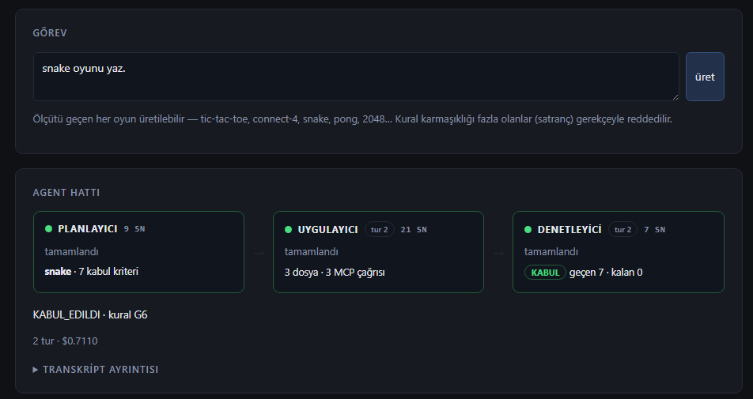
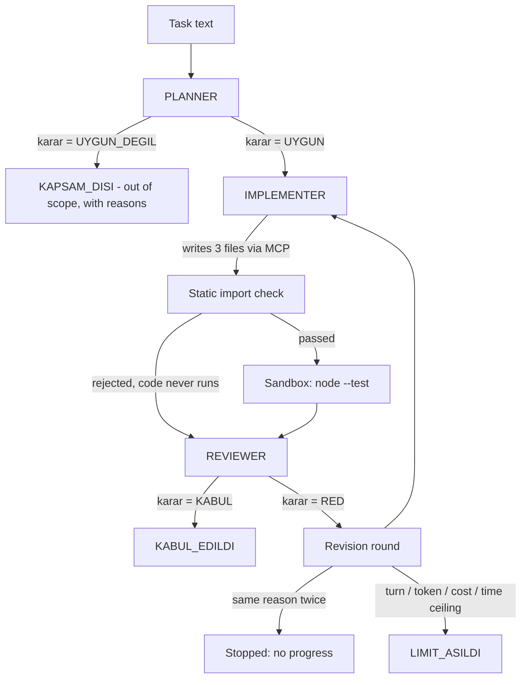
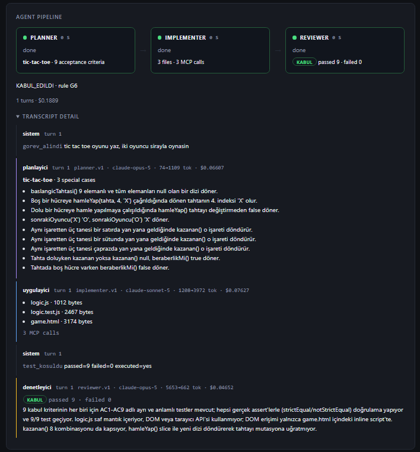
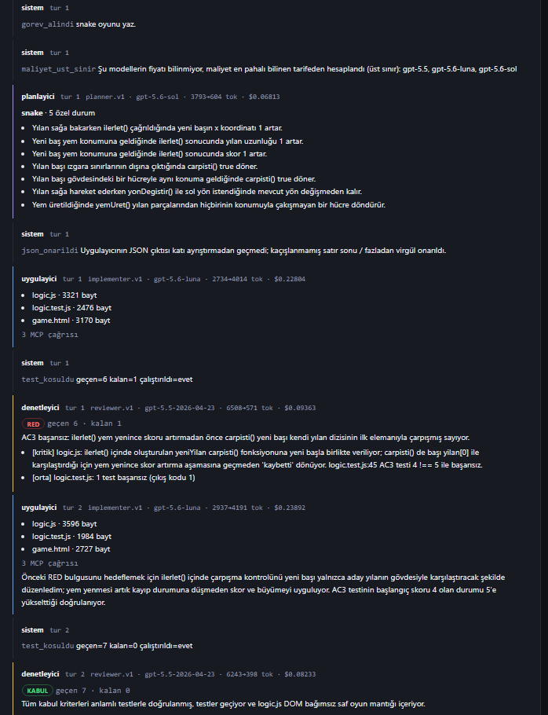
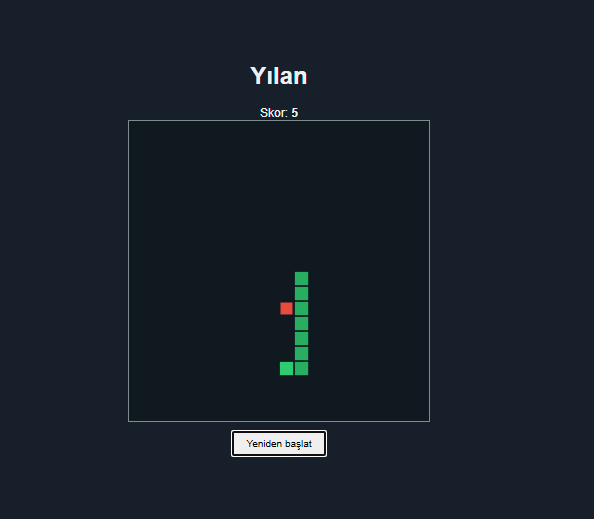
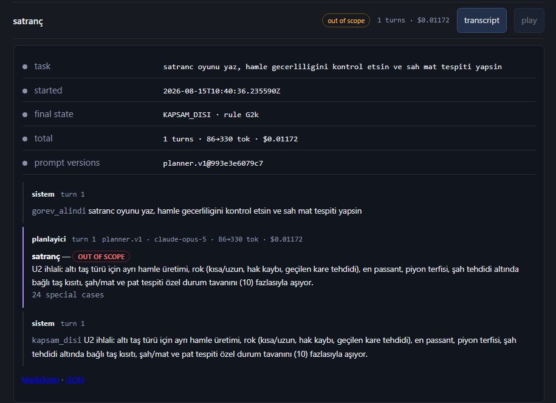
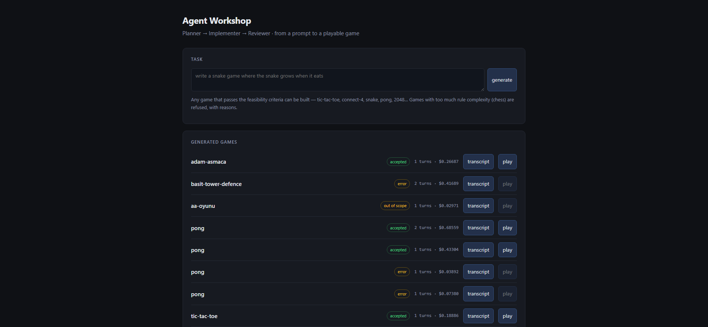
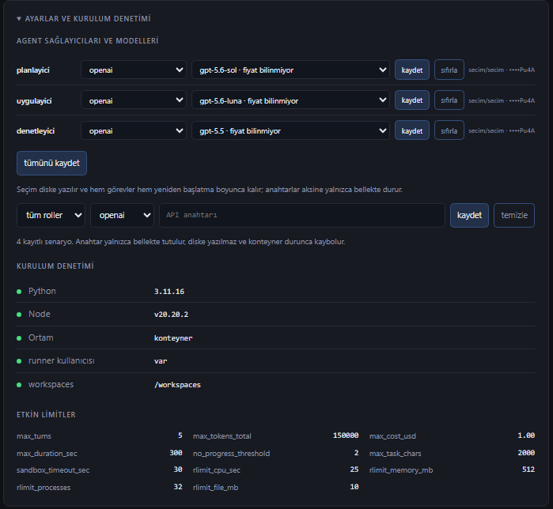

# Agent Workshop

A three-agent pipeline that turns a natural-language request into a playable
browser game. A **planner** decides whether the request is buildable and writes
testable acceptance criteria, an **implementer** writes the code, and a
**reviewer** runs the tests and either accepts the work or rejects it with
file-and-line findings. The reviewer's authority to reject is the mechanism the
system is built around: without it the three agents would only take turns
producing text, and nothing would establish that the output works. Rejection is
the normal path rather than the error path — it produces a revision round — and
out-of-scope requests are refused outright instead of attempted and failed.



---

## What was measured

**411 tests pass in Docker** in about 17 seconds, with no API key and no network
calls (verified 2026-09-05).

Across **32 recorded runs against real providers**:

| Outcome | Runs |
|---|---|
| `KABUL_EDILDI` — accepted | 16 |
| `KAPSAM_DISI` — refused as out of scope | 6 |
| `HATA` — ended in an error state | 10 |

In four of those runs the reviewer rejected turn 1 and accepted the revision on
turn 2. Cost on accepted runs ranged from about $0.18 to $1.24, depending on
which models were assigned to each role.

**The 10 error runs**, since the failure modes are as informative as the
successes. Four were planner schema violations: the model emitted an accented
`gerekli_özellikler` instead of `gerekli_ozellikler`, and strict validation
refused it rather than accepting a near-miss. Four were implementer outputs
truncated mid-JSON — the repair pass fixes only unescaped control characters and
trailing commas and will not invent closing braces, so a truncated response
fails loudly instead of producing plausible-looking wrong files. Two were
provider HTTP 404s for a model the account could not access. All three classes
surface in the transcript rather than being hidden.

> Language: the interface is English; the agent prompts, and therefore the
> agents' own output, are Turkish. The reason is under
> [Known limitations](#known-limitations).

---

## Architecture



The orchestrator is a finite state machine with eight states — `PLANLANIYOR`,
`UYGULANIYOR`, `DENETLENIYOR`, `REDDEDILDI`, `KABUL_EDILDI`, `KAPSAM_DISI`,
`LIMIT_ASILDI`, `HATA` — driven by named events. No agent decides when a run
ends; the state machine does.

Each agent returns a single JSON object and nothing else. Field names are
Turkish because the prompts are.

The [**planner**](prompts/planner.v1.md) returns `oyun` and an
`uygulanabilirlik` block (`karar` = `UYGUN` or `UYGUN_DEGIL`, `gerekce`,
`ozel_durum_sayisi`, `gercek_zamanli`, `harici_varlik_gerekli`) plus `adimlar`,
`kabul_kriterleri` and `dosyalar`, the last three forced empty on a refusal. The
[**implementer**](prompts/implementer.v1.md) returns `dosyalar` — the full text
of `logic.js` (pure logic, no DOM), `logic.test.js` (`node:test` and
`node:assert` only) and `game.html` — plus `degisiklik_notu`; on a revision turn
it may change only what the reviewer's findings name. The
[**reviewer**](prompts/reviewer.v1.md) returns the verdict:

```json
{
  "karar": "RED",
  "gerekce": "10-500 chars, concrete",
  "bulgular": [
    { "dosya": "logic.js", "sorun": "which file, what is wrong, which line shows it", "onem": "kritik" }
  ],
  "test_sonucu": { "gecen": 4, "kalan": 1, "cikti": "<node --test output>" }
}
```

`karar` is `KABUL` or `RED`; at least one finding is schema-enforced on `RED`;
`onem` is exactly `kritik`, `orta` or `dusuk`.

Two rules make the verdict hard to fake:

1. **The reviewer does not measure the test result.** `gecen` and `kalan` are
   measured by the system from the real run and substituted over whatever the
   reviewer wrote. An optimistic number does not rescue a verdict; it only makes
   the contradiction visible.
2. **`kalan > 0` with `karar = KABUL` is coerced to `RED`.** Accepting work with
   failing tests is not expressible.

Passing tests are not sufficient either. If no test meaningfully verifies a
given `kabul_kriteri`, the reviewer must raise a `kritik` finding and reject:
"the tests passed" and "the criteria are met" are different claims. An accepted
verdict shows the same discipline — below, the reviewer does not stop at 9/9
passing but records that each of the nine criteria has its own named test
(AC1–AC9) asserting with `strictEqual`/`notStrictEqual`, and that `logic.js`
touches no DOM or browser API.



---

## The loop in practice

A connect-4 run, rejected on turn 1. The finding rewards reading: the reviewer
concluded the *test* was wrong rather than the logic — the draw board AC6 builds
from a `(row + column) % 2` pattern contains four identical pieces on a
diagonal, so `kazanan()` correctly reports a winner and the `null` expectation
at `logic.test.js:58` is the thing at fault.

```json
{
  "karar": "RED",
  "gerekce": "AC6 testi geçersiz bir beraberlik tahtası oluşturuyor: dama deseni çapraz yönde dört aynı taşı içerdiği için kazanan() doğru olarak 'R' döndürüyor ve test başarısız oluyor.",
  "bulgular": [
    {
      "dosya": "logic.test.js",
      "sorun": "AC6 testindeki (satir + sutun) % 2 deseni, down-right çaprazlarında dört aynı taşı oluşturuyor; logic.test.js:58'de kazanan(tahta) için null beklentisi bu nedenle yanlış.",
      "onem": "kritik"
    }
  ],
  "test_sonucu": { "gecen": 5, "kalan": 1, "cikti": "TAP version 13 ..." }
}
```



An accepted game is played on the same page, inside the sandboxed iframe:



**An out-of-scope request.** `satranç oyununu yaz` ("write chess") never reaches
the implementer. The planner counts 24 rule special cases against a ceiling of
ten, returns `UYGUN_DEGIL` with `adimlar` and `kabul_kriterleri` forced empty,
and the run ends in `KAPSAM_DISI` for about a cent.



---

## Safety and constraints

Generated code is executed, so it is treated as untrusted. Each defence below is
covered by negative tests.

**Scope is a criterion, not a whitelist.** The planner has no list of games.
Requests are judged on five criteria: state representable in one data structure
(U1), ten or fewer rule special cases (U2), win and end conditions verifiable by
a pure function (U3), no separate asset file (U4), and real-time explicitly
*not* disqualifying (U5). Games on no list — connect-4, 2048, hangman — get
built; chess is refused for exceeding U2. The planner cannot game its own
verdict: declaring `UYGUN` while reporting more than ten special cases
invalidates the decision.

**Static import check before execution.** An allowlist, not a blocklist — "it
wasn't on the forbidden list" is not a defence. Only `node:test`, `node:assert`,
`node:assert/strict` and relative requires written as a constant string literal
(no `..`) pass. These are rejected regardless of imports:

| Construct | Reason |
|---|---|
| Dynamic `require(...)` / `import(...)` | Module name computed at runtime defeats the allowlist |
| `eval(...)`, `new Function(...)` | Same |
| `fetch(...)`, `XMLHttpRequest`, `navigator.sendBeacon` | Network egress |
| `process.env` | Environment variable access |
| `process.binding`, `process.dlopen` | Native addon loading |
| `WebAssembly.compile` / `.instantiate` | Unauditable execution |

Rejected code is never run: the reviewer gets `kritik` findings and `kalan = 1`,
and a turn is spent.

**Process-level sandbox.** Tests run as an unprivileged `runner` user inside the
container, under ceilings applied by a launcher subprocess: `RLIMIT_CPU` 25 s,
`RLIMIT_DATA` 512 MB, `RLIMIT_NPROC` 32, `RLIMIT_FSIZE` 10 MB, `RLIMIT_CORE` 0,
plus a 30 s wall-clock `SIGKILL`. Paths are canonicalised so nothing escapes the
task workspace, the environment is scrubbed before exec, and captured output is
capped. The Docker socket is not mounted. In the browser, generated games are
served into a `sandbox="allow-scripts"` iframe under a CSP that blocks network
egress.

**Prompt injection is treated as data.** The task text reaches the planner
inside explicit delimiters. "Ignore previous instructions" changes neither the
schema nor the U1–U5 criteria; it is handled as an ordinary out-of-scope request.

**Stopping on repeated rejection.** Two rejections in a row for the same
underlying reason stop the run. The reviewer must state what changed and what
did not between rounds, so the check has something real to compare.

**Operational ceilings**, checked between turns. Breaching any of them ends the
run in `LIMIT_ASILDI` with the ceiling named in the transcript. Cost is computed
per provider and model from a pricing table, not estimated.

| `MAX_TUR` | `MAX_TOKEN_TOPLAM` | `MAX_MALIYET_USD` | `MAX_SURE_SN` | `MAX_GOREV_KARAKTER` | `SANDBOX_TIMEOUT_SN` |
|---|---|---|---|---|---|
| 5 turns | 150,000 | $1.00 | 300 s | 2,000 chars | 30 s |

---

## Deterministic testing: record/replay cassettes

LLM non-determinism normally makes acceptance tests for an agent system
impossible to write. Here every provider call goes through one interface, and a
`replay` provider serves recorded responses from cassettes in
`tests/cassettes/`. A cassette is keyed by a fingerprint of the request — model,
`max_tokens`, a hash of the system prompt, and the messages — so a response is
served only when the input matches; change a prompt and the cassette stops
matching instead of returning a stale answer. Outputs are normalised first to
strip timings and task-specific paths.

So the whole suite runs with no API key and no network calls, and anyone who
clones the repository can run two end-to-end scenarios — one acceptance, one
refusal — at no cost. The tests and the file writes are real in replay mode;
only the LLM responses come from the cassette.

---

## Getting started

**Docker is the only prerequisite and the canonical way to run this.** Python
3.11 and the Node 20 binary both live in the image. The sandbox depends on POSIX
facilities — `os.setuid`, `pwd`, `resource.setrlimit` — so it does not run
natively on Windows; a direct `pytest` run there leaves roughly 30 sandbox and
security tests failing on `os.getuid` and symlink privileges.

```bash
git clone https://github.com/kaanismen/AgenticGameWorkshop.git
cd AgenticGameWorkshop
docker compose up               # then open http://localhost:8000
docker compose run --rm test    # 411 tests, no key required
```

With no `.env` present the system starts in `replay` mode and plays the recorded
scenarios — no key, no charges.



For live runs, copy [`.env.example`](.env.example) to `.env` and set
`LLM_PROVIDER` (`anthropic`, `openai`, `ollama` or `replay`) with the matching
key — or enter keys in the settings panel, where provider and model are
selectable **per agent role** from the provider's live catalogue. Runtime keys
stay in memory, redacted from transcripts, never written to disk. The same panel
reports a setup audit and every ceiling with its effective value.



The web layer is FastAPI with a Server-Sent Events stream that renders the
transcript live (`GET /api/gorev/akis`). File writes go through a real **MCP
server** — JSON-RPC 2.0 over stdio, exposing `dosya_yaz`, `dosya_oku` and
`dosya_listele` — with every path validated against the workspace root first.

---

## Project status

Complete, not under active development. The test suite is green and the recorded
scenarios run.

### Known limitations

- **`game.html` is verified by no layer.** The system guarantees `logic.js`
  through tests; the UI passes through no automatic gate. This has bitten in
  practice: a generated connect-4 had correct logic and 9 passing tests while
  its colour mapping was reversed. `KABUL_EDILDI` means the tests passed, not
  that the game is correct in every respect.
- **Language.** The web interface is in English. The system event names in the
  transcript (`gorev_alindi`, `plan_sema_hatasi`, `maliyet_ust_sinir`,
  `test_kosuldu`, `json_onarildi`, `ilerleme_yok`) and the JSON contract field
  names (`karar`, `gerekce`, `kabul_kriterleri`, `bulgular`) are Turkish: they
  are part of the agent contracts, and the system prompts are Turkish.
  Agent-generated content — plan criteria, reviewer rationale — is therefore
  Turkish as well. Translating the prompts would invalidate the recorded
  cassettes, whose fingerprints include a hash of the system prompt, and break
  the offline path that runs the test suite and the demo scenarios without an
  API key. A deliberate trade-off, listed here as a limitation.
- **Implementer output truncation.** Larger games can exceed the implementer's
  output token budget, producing an unclosed JSON object. The repair pass
  rejects it rather than guessing the missing braces, so the turn is lost.
  Observed in 4 of 32 runs.
- **Scope is a soft constraint enforced by the planner, not a hard whitelist.**
  Out-of-scope requests are rejected by planner judgment against the U1–U5
  criteria, so a borderline game may be accepted and then fail later in the
  pipeline.
- Six open limitations, including the first above, are documented with their
  consequences in [`docs/teknik.md`](docs/teknik.md) §8.

---

## Documentation

The design documents are in Turkish and more detailed than this README.

| File | Contents |
|---|---|
| [docs/kilavuz.md](docs/kilavuz.md) | User guide — setup, usage, state reference, troubleshooting |
| [docs/analiz.md](docs/analiz.md) | Analysis — user stories, acceptance criteria, traceability matrix |
| [docs/teknik.md](docs/teknik.md) | Technical design — architecture, data model, API contract, measurements, known limits |
| [docs/ai-gunlugu.md](docs/ai-gunlugu.md) | AI development log — an audit record of how the system was built with AI assistance, which decisions were the author's, and which AI proposals were overruled |
| [docs/faz-plani.md](docs/faz-plani.md) | Dependency analysis and build order |
| [docs/README.tr.md](docs/README.tr.md) | Turkish version of this README |
| [PROJECT.md](PROJECT.md) | Binding context package used during development |

The code was written with AI assistance; the prompts in `prompts/` were written
by hand. `docs/ai-gunlugu.md` is the record of that process.

## Background

Initially built during the GTech Financial Technologies Academy program
(August 2026).

## License

MIT — see [LICENSE](LICENSE).
